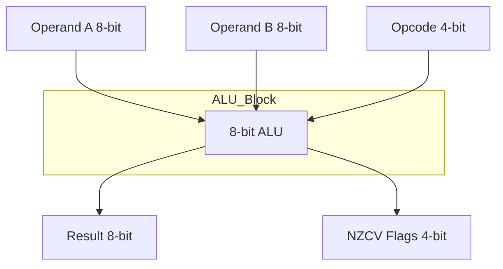

# Experiment 1: Advanced 8-bit ALU with NZCV flags

## 1. Objective
To design, simulate, and implement an Advanced 8-bit Arithmetic Logic Unit (ALU) capable of performing various arithmetic and logical operations while generating Negative (N), Zero (Z), Carry (C), and Overflow (V) flags.

## 2. Block Diagram

## 3. RTL Design
The design consists of an 8-bit ALU that supports operations such as ADD, SUB, AND, OR, XOR, NOT, and shifts. 
- **8-bit ALU**: The core logic performs the selected operation based on a 4-bit Opcode.
- **NZCV Flags**:
  - **N (Negative)**: Set if the MSB of the result is 1.
  - **Z (Zero)**: Set if the result is exactly zero.
  - **C (Carry)**: Set if an arithmetic operation generates a carry out from the MSB.
  - **V (Overflow)**: Set if an arithmetic operation results in a signed overflow.
- **PYNQ-Z2 Auto-Test Wrapper**: A wrapper module designed for the PYNQ-Z2 board to facilitate automated testing by mapping the ALU I/O to the board's switches, buttons, and LEDs for hardware validation.

## 4. Simulation Results
*(Placeholder: Insert simulation waveform screenshots here)*
- Screenshot 1: Addition and Subtraction with N and C flags.
- Screenshot 2: Logical operations with N and Z flags.
- Screenshot 3: Overflow condition during signed arithmetic.

## 5. Hardware Implementation
*(Placeholder: Insert hardware setup photos and resource utilization report here)*
- Photo 1: PYNQ-Z2 board showing ALU inputs via switches.
- Photo 2: PYNQ-Z2 board showing output result and flags on LEDs.
- **Resource Utilization**: (Insert table/screenshot of LUTs, FFs, etc. used).

## 6. Applications
- Central Processing Unit (CPU) ALUs
- Digital Signal Processing (DSP) applications
- Embedded microcontrollers

## 7. Conclusion
An 8-bit Advanced ALU with accurate NZCV flag generation was successfully designed and tested. The implementation on the PYNQ-Z2 board verifies the hardware functionality, making it a reliable building block for more complex computational architectures.
