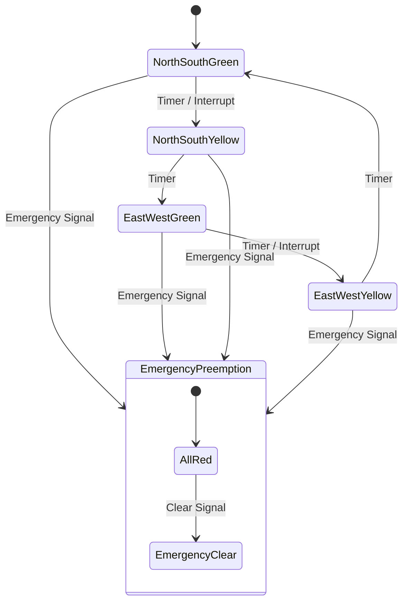
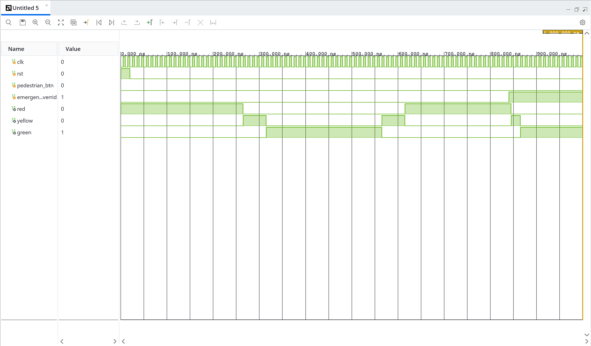
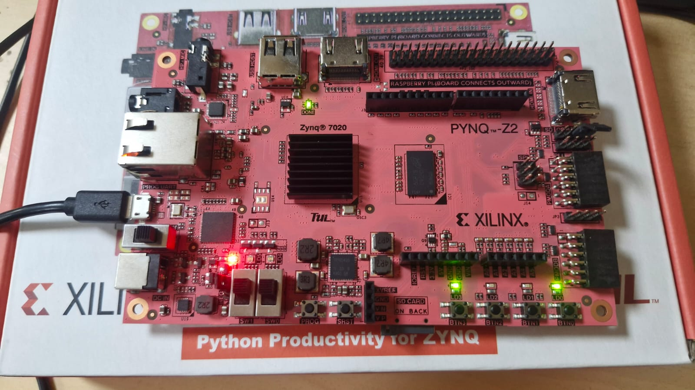

# Experiment 2: Smart Traffic Light Controller

## 1. Objective
To design and implement a Smart Traffic Light Controller utilizing a Finite State Machine (FSM), featuring pedestrian interrupt capabilities and an emergency vehicle preemption system.

## 2. Block Diagram

## 3. RTL Design
The Smart Traffic Light Controller is primarily driven by a Finite State Machine (FSM).
- **FSM Logic**: Controls the sequence of states: North-South Green, North-South Yellow, East-West Green, and East-West Yellow. The transitions are governed by timers.
- **Pedestrian Interrupt**: When a pedestrian button is pressed, the FSM safely transitions the active green light to yellow and then to red, allowing pedestrians to cross safely.
- **Emergency Preemption**: An emergency signal forces the FSM into a high-priority state (e.g., all red or specific direction green) to allow emergency vehicles to pass without delay.
- **Debounce Logic**: Since the pedestrian buttons and emergency switches are mechanical, debounce circuitry is implemented to ensure clean, glitch-free single pulses are sent to the FSM.

## 4. Simulation Results
**
- Screenshot 1: Normal traffic light cycle.
- Screenshot 2: Pedestrian interrupt triggering state change.
- Screenshot 3: Emergency preemption overriding normal operation.

## 5. Hardware Implementation
**
- Photo 1: PYNQ-Z2 board displaying normal sequence on RGB LEDs.
- Photo 2: Board reacting to a button press (Pedestrian Interrupt).

## 6. Applications
- Urban traffic management systems
- Automated pedestrian crossing controls
- Industrial automated guided vehicle (AGV) intersection control

## 7. Conclusion
The Smart Traffic Light Controller was effectively implemented using an FSM. The integration of debounce logic ensured reliable input handling, while the pedestrian interrupt and emergency preemption features demonstrated the system's ability to handle complex, real-world, priority-based scenarios.
