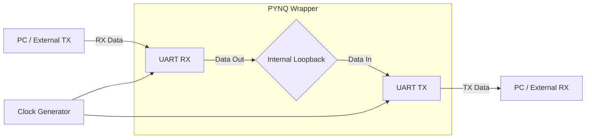

# Experiment 3: UART Transceiver with Internal Loopback

## 1. Objective
The objective of this experiment is to design, simulate, and implement a Universal Asynchronous Receiver-Transmitter (UART) transceiver. The design includes both Receiver (RX) and Transmitter (TX) modules, operating at 9600 baud with 16x oversampling and even parity, wrapped in a PYNQ internal loopback for hardware verification.

## 2. Block Diagram

## 3. RTL Design
The RTL design is built around the following key components:
- **UART RX/TX:** Handles the asynchronous serial communication.
- **9600 Baud Rate & 16x Oversampling:** The baud rate generator uses the system clock to create a tick at 16 times the 9600 baud rate (153,600 Hz). This oversampling allows the receiver to accurately sample the data line at the middle of each bit period, ensuring robust data reception even with slight timing mismatches.
- **Even Parity:** Both the transmitter and receiver are configured to generate and check for even parity. The transmitter appends a parity bit to make the total number of 1s even, and the receiver verifies this to detect single-bit errors.
- **Internal Loopback PYNQ Wrapper:** To facilitate testing without complex external wiring, a PYNQ wrapper is implemented. This wrapper connects the UART RX output directly to the UART TX input, echoing back any data received from the host system.

## 4. Simulation Results
*(Add screenshots of behavioral simulation waveforms here, showing the RX sampling process, TX shifting out data, and parity bit generation/checking)*

## 5. Hardware Implementation
*(Add photos of the setup or screenshots of the PYNQ Jupyter Notebook showing successful loopback tests)*

## 6. Applications
- **PC to FPGA Communications:** UART is widely used for simple, low-speed communication between a host computer and the FPGA for debugging and control.
- **IoT Devices:** Many sensors, GPS modules, and IoT microcontrollers (like ESP8266/ESP32) interface via UART.

## 7. Conclusion
This experiment successfully demonstrates the implementation of a complete UART transceiver. The inclusion of 16x oversampling improves reception reliability, and even parity provides basic error detection. The internal loopback wrapper enabled quick and efficient hardware verification on the PYNQ platform.
