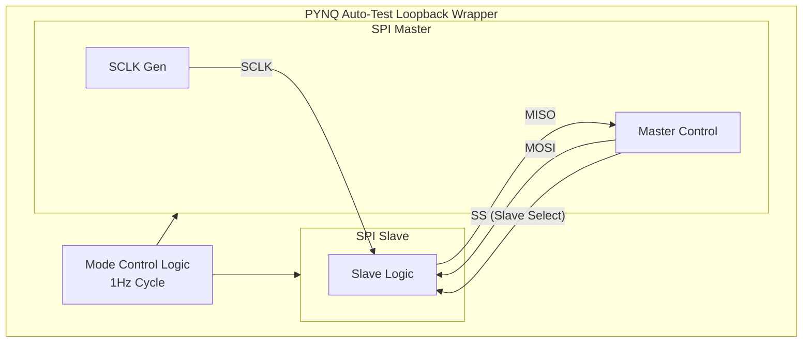

# Experiment 4: SPI Multi-Mode Master/Slave

## 1. Objective
The objective of this experiment is to design and implement a Serial Peripheral Interface (SPI) system featuring both Master and Slave modules capable of supporting all four SPI modes (combinations of Clock Polarity - CPOL and Clock Phase - CPHA). The system includes a PYNQ Auto-Test loopback wrapper for automated verification.

## 2. Block Diagram

## 3. RTL Design
The design implements a highly configurable SPI communication link:
- **Master vs Slave Logic:** The SPI Master generates the serial clock (SCLK) and drives the Slave Select (SS) line to initiate communication. It transmits data on the Master Out Slave In (MOSI) line and receives on the Master In Slave Out (MISO) line. The Slave module relies on the incoming SCLK and SS signals, reading from MOSI and driving MISO appropriately.
- **CPOL/CPHA Support:** The design supports all four standard SPI modes (Modes 0, 1, 2, and 3). Clock Polarity (CPOL) determines the idle state of the clock line (0 or 1), while Clock Phase (CPHA) determines which clock edge (leading or trailing) is used for sampling and which is used for shifting data.
- **PYNQ Auto-Test Loopback Wrapper:** To rigorously verify all SPI modes, a specialized PYNQ wrapper is employed. This wrapper connects the Master's MOSI directly to the Slave's MOSI input (and MISO to MISO). It includes logic that automatically cycles through the four SPI modes (CPOL/CPHA combinations) at a rate of 1Hz, verifying correct loopback transmission in each mode without manual intervention.

## 4. Simulation Results
*(Add screenshots of waveforms demonstrating data transfer across different CPOL/CPHA settings)*
- `[Placeholder: SPI Mode 0 (CPOL=0, CPHA=0) Waveform]`
- `[Placeholder: SPI Mode 1 (CPOL=0, CPHA=1) Waveform]`
- `[Placeholder: SPI Mode 2 (CPOL=1, CPHA=0) Waveform]`
- `[Placeholder: SPI Mode 3 (CPOL=1, CPHA=1) Waveform]`

## 5. Hardware Implementation
*(Add photos of the FPGA running the test or screenshots of the PYNQ interface reporting success across all modes)*
- `[Placeholder: FPGA Board Photo]`
- `[Placeholder: Auto-Test Terminal/Notebook Output]`

## 6. Applications
- **High-Speed Peripherals:** Used for interfacing with SD cards, LCD screens, and high-speed ADCs/DACs.
- **Inter-IC Communication:** A standard protocol for short-distance, on-board communication between microcontrollers and various sensor ICs.

## 7. Conclusion
The implemented SPI Multi-Mode Master/Slave system successfully demonstrates flexible, high-speed serial communication. By supporting all CPOL and CPHA configurations, the modules can interface with virtually any standard SPI peripheral. The 1Hz automated loopback test on the PYNQ platform proved the robustness and correctness of the RTL design across all operational modes.
