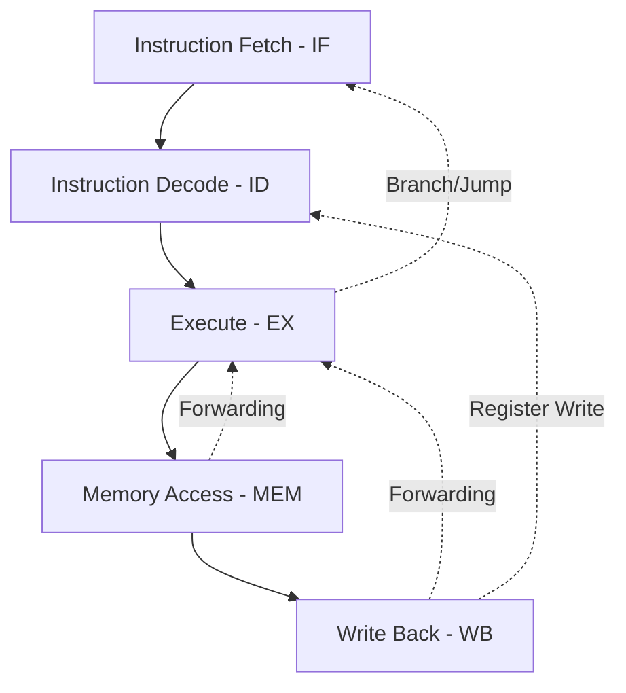

# Experiment 5: Advanced - Pipelined RISC-V Processor

## 1. Objective
The objective of this experiment is to design, implement, and verify a 32-bit pipelined RISC-V processor supporting the RV32I Instruction Set Architecture (ISA). This advanced design aims to improve instruction throughput compared to a single-cycle processor by executing multiple instructions concurrently across different pipeline stages, while effectively handling data and control hazards.

## 2. Block Diagram

## 3. RTL Design
The processor is built around the 32-bit RISC-V RV32I ISA and is structured into a classic 5-stage pipeline to maximize throughput:
1. **Instruction Fetch (IF):** Fetches the next instruction from instruction memory based on the Program Counter (PC).
2. **Instruction Decode (ID):** Decodes the fetched instruction, reads operands from the register file, and generates the necessary control signals.
3. **Execute (EX):** Performs Arithmetic Logic Unit (ALU) operations and calculates branch target addresses.
4. **Memory Access (MEM):** Reads from or writes to the data memory.
5. **Write Back (WB):** Writes the resulting data from the ALU or memory back to the register file.

To maintain correct execution in the presence of pipeline hazards, the design includes:
* **Forwarding Unit:** Resolves Read-After-Write (RAW) data hazards by forwarding results directly from the MEM or WB stages back to the EX stage, eliminating the need to wait for the register write to complete.
* **Hazard Unit:** Handles load-use data hazards by stalling the pipeline when a dependent instruction immediately follows a load instruction. It also manages control hazards by flushing the pipeline (clearing the IF and ID stages) when a branch or jump is taken.

The processor executes a hardcoded Fibonacci program stored in the instruction memory, demonstrating correct instruction fetching, decoding, arithmetic operations, and robust hazard handling.

## 4. Simulation Results
*[Placeholder: Insert simulation waveforms and timing analysis here]*

## 5. Hardware Implementation
*[Placeholder: Insert resource utilization, clock frequency, and on-board testing results here]*

## 6. Applications
Pipelined processors are fundamental to modern computing architectures. Specific applications include:
* **Embedded Systems:** Providing efficient, low-power processing for IoT devices and smart appliances.
* **Automotive Microcontrollers:** Powering engine control units, Advanced Driver Assistance Systems (ADAS), and in-vehicle infotainment systems, similar to highly reliable microcontrollers developed by companies like NXP.
* **Custom Accelerators:** Serving as efficient control processors for specialized hardware accelerators in FPGAs and ASICs.

## 7. Conclusion
Implementing a 5-stage pipelined RISC-V processor provided deep insights into advanced computer architecture concepts. Successfully resolving data and control hazards through forwarding and stalling was crucial for maintaining correctness without severely impacting performance. The project demonstrates a solid understanding of RTL design, pipeline optimization, and complex digital systems.
